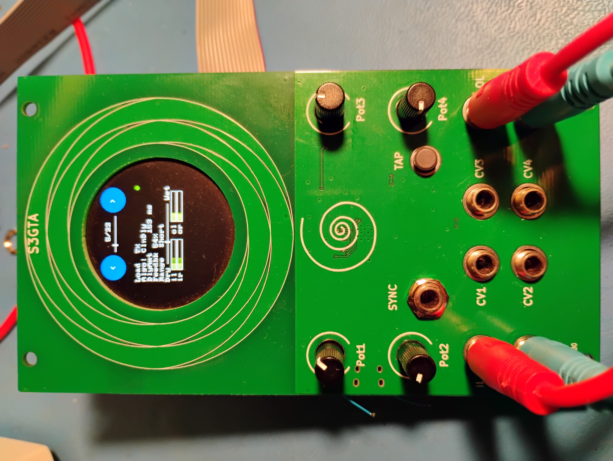

# S3GTA
A Eurorack effects module based on the ESP32S3

## Abstract
This project builds on my previous ESP32S2 design:

https://github.com/emeb/ESP32S2_Audio

taking it further with a circular LCD, touch sensing and more CV inputs. It's
based on an ESP32S3 with 4MB flash and 2MB PSRAM in the package, as well as
dual CPU cores to potentially provide more DSP bandwidth.

### What's with the name?
I'm terrible at coming up with catchy names for my projects and this one is no
departure from that. It breaks down thus:
* S3 from the ESP32S3 processor
* G from the GC9A01 LCD
* T from the circular touch sensor
* A from audio I/O

## Hardware
The hardware consists of two PCBs - a front-panel board that provides the main
Eurorack user interface including a 240x240 circular LCD with a circular touch
sensor surrounding it and the MCU & audio codec, coupled with a back board that
includes the Eurorack power as well as audio and CV interfaces for the front-panel.

The front-panel PCB contains the following components:
* ESP32-S3FH4R2 MCU with 4MB flash and 2MB PSRAM integrated in the package
* WM8731 I2S audio codec
* 4 pad proportional circular touch sensor
* 4 CVs, stereo in/out and sync + button interfaces to back board.
* optional USB and Qwicc connectors

The back board has
* Standard Eurorack 16-pin shrouded power connector
* Four +/-5V CV inputs and associated analog signal conditioning
* Four offset pots for the CVs
* Two +/-7V Audio inputs and associated analog signal conditioning 
* Two +/-7V Audio outputs and associated analog drivers
* Tap tempo button
* Sync input jack

## Firmware
A demonstration firmware is included that exercises all of the capabilities of
the system, including the LCD, UI button, CV inputs and stereo audio I/O. It is
a basic multi-effects unit that supports a complement of audio DSP algorithms
that are easily extended by adding standardized modules to a data structure.
As provided here just three algorithms are available:
* Simple pass-thru with no processing
* Simple gain control
* Lowpass, Highpass and Bandpass filters
* Basic "clean delay" with crossfaded deglitching during delay changes.

Other algorithms have been tested including phasers, flangers, frequency shifters,
resampling delays and reverbs, but these are not publicly released at this time.

## Findings
The ESP32Ss is not bad for doing audio and the I2S driver in ESP-IDF V5.2.3 does
include good support for realtime audio processing. There are a few hiccups in
the way it works that are commented in the source code, but overall it does a
good job of supporting audio effects processing.

I found that in general the DSP on the ESP32S3 was usable, although not as
efficient as on ARM processors. Some algorithms showed significantly higher CPU
loading on the ESP32S3 than on ARM Cortex M7, even accounting for clock speed
differences. Studying the disassembly of the object code suggests that the full
DSP capability of the ESP32S3 Xtensa CPU ISA isn't being brought to bear by the
GCC compiler - for example the available multiply-accumulate instructions were
not used in cases where they may have reduced overall instruction counts.

## Future work
The UI is fairly primitive and doesn't make effective use of the circular touch
sensor. In the initial release there are only two "soft buttons" that employ
the touch sensor to select the current algorithm and this could be extended
to allow more soft buttons, deeper menuing and even continuously variable
adjustmets for things like on-board modulation.

The graphic elements on the circular LCD are also pretty tiny and hard to read
while also not taking full advantage of the available LCD area. It would be
interesting to "lean in" to the round nature of the display with more arcs
and circular UI elements. Fatter lines and larger fonts would help a lot too.
One option is to ditch the home-made graphics library I used here and try to
leverage LVGL which is available as an external module in ESP IDF - I did a
bit of research into this at the outset but went with my existing graphics
for ease of porting older code.
